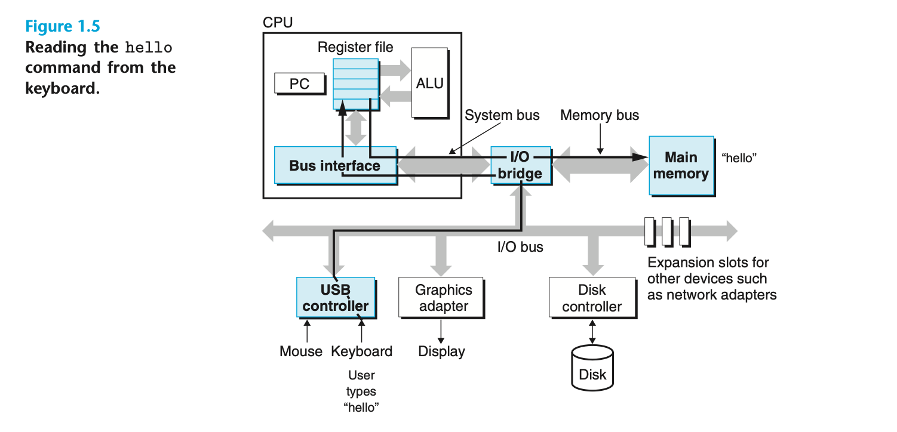
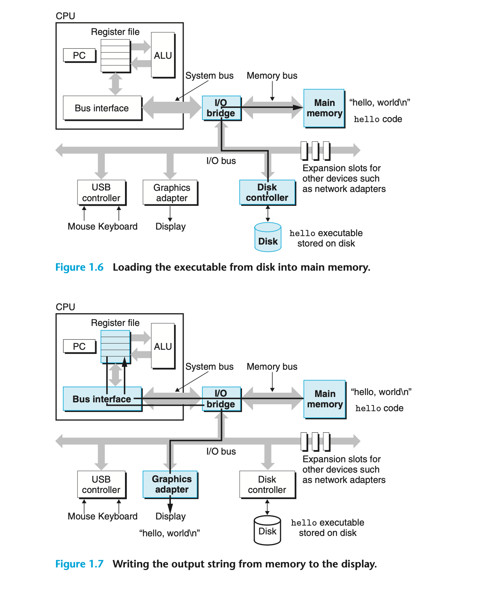

From Randal Bryant:
> Initially, the shell program is executing its instructions, waiting for us to type a command. As we type the caracters `./hello` at the keyboard, the shell program reads each one into a register and then stores it in memory. 
> When we hit the `enter` key on the keyboard, the shell knows that we have finished typing the command. The shell then loads the executable `hello` file by executing a sequence of instructions that copies the code and data in the `hello` object file from disk to main memory. The data includes the string of characters `hello, world\n` that will eventually be printed out.

Comments on the image:
> Each I/O device is connected to the I/O bys by either a controller or an adapter. The distinction between the two is mainly one of packaging. Controllers are chip sets in the device itself or on the system's main printed circuit board (often called the motherboard). An adapter is a card that plugs into a slot on the bmotherboard. Regardless, the purpose of each is to transfer information back and forth between the I/O bus and an I/O device.

The processor:
> From the time that power is applied to the system until the time that the power is shut off, a processor repeatedly executes the instruction pointed at by the program counter and updates the program counter to the point to the next instruction. A processor appears to operate according to a very simple instruction execution modl, define by its instruction set achitecture. In this model, instructions execute in strict sequence, and executing a single instruction involves performing a series of steps. 

> The processor reads the instruction from memory pointed at by the program counter (PC), interprets the bits in the instruction, performs some simple operation dictated by the instruction, and the updates the PC to pointo the next instruction, which may or may not be contiguous in memory to the instruction that was just executed. 
